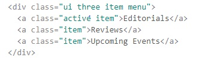

I have always heard of frameworks being used for web development, but never really had a chance to look into one. Coming from someone who made websites purely with using raw HTML and CSS, Semantic UI is a time saver. When I used to make websites, I would think critically of every detail a page needs. This includes its sizing, margin and paddings needed to produce a good webpage. With Semantic UI, it does all the work for you!
 

The syntax is easy to pick up and understand. In this picture included here, at a glance I can tell that this is menu that has several items. 
 

All I need to do is call class names for it to activate!
 

When I heard that students of ICS 314 would have to recreate websites for WODs a couple months ago, I thought that it wasn’t realistically possible when put on timer. How in the world am I supposed to do that? Fortunately for Semantic UI, it does everything for me. Now when creating a website, all I need to do is remember the most important factors of a website such as Menus or Containers. 
 

This week was probably the best learning material that we ever had. I felt that the time commited to this material, will end up being porportional to the time I save using Semantic UI in the future. Although this may seem odd, I am now interested in seeing how other frameworks behave. There's nothing wrong with cutting corners if it can produce good results :) .
